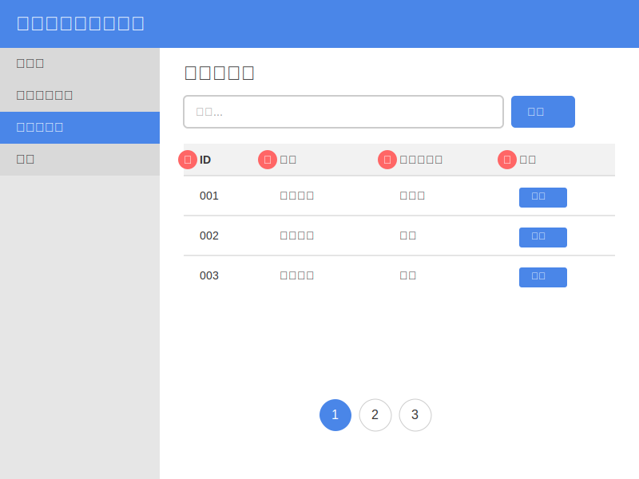

= ログイン機能詳細設計

== 1. コントローラ: `LoginHistoryController`
- **名前空間**: `Eccube\Controller\Admin\Setting\System`
- **目的**: 管理パネルでのログイン履歴の表示と処理を担当。
- **ルート**:
  * `/setting/system/login_history`: ログイン履歴検索ページを表示。
  * `/setting/system/login_history/{page_no}`: ログイン履歴のページネーションを処理。
- **依存関係**:
  * `PageMaxRepository`: ページネーション設定を取得。
  * `LoginHistoryRepository`: ログイン履歴データをクエリ。
- **メソッド**:
  * `index(Request $request, PaginatorInterface $paginator, $page_no = null)`: ログイン履歴のGETおよびPOSTリクエストを処理するメインメソッド。フォームの送信、セッションデータ、ページネーションを管理。

== 2. フォーム: `SearchLoginHistoryType`
- **目的**: ログイン履歴を検索するためのフォームを定義。
- **使用箇所**: `LoginHistoryController`の`index`メソッド内で作成および処理。

== 3. リポジトリ: `LoginHistoryRepository`
- **目的**: データベースからログイン履歴データをクエリするメソッドを提供。
- **主要メソッド**: `getQueryBuilderBySearchDataForAdmin($searchData)`: 管理者が提供する検索条件に基づいてクエリを構築。

== 4. セッション管理
- コントローラはセッション変数を使用して検索条件とページネーションの状態を保存し、ユーザーが検索を中断した場所から再開できるようにする。

== 5. ページネーション
- `Knp\Component\Pager\PaginatorInterface`を使用してログイン履歴の結果をページネーション。

== 6. テンプレート
- **パス**: `@admin/Setting/System/login_history.twig`
- **目的**: 検索フォームとページネーションコントロールを含むログイン履歴ページをレンダリング。

[mermaid]
----
sequenceDiagram
    participant User as ユーザー
    participant Browser as ブラウザ
    participant Server as サーバー
    participant DB as データベース

    User->>Browser: ログインページを開く
    Browser->>Server: ログインページをリクエスト
    Server->>Browser: ログインフォームを返す
    User->>Browser: ユーザー名とパスワードを入力
    Browser->>Server: ログイン情報を送信
    Server->>DB: ユーザー情報を確認
    alt 認証成功
        DB-->>Server: ユーザー情報を返す
        Server->>Browser: ログイン成功メッセージを返す
        Browser->>User: ログイン成功を表示
    else 認証失敗
        DB-->>Server: 認証失敗を通知
        Server->>Browser: エラーメッセージを返す
        Browser->>User: エラーメッセージを表示
    end
----
